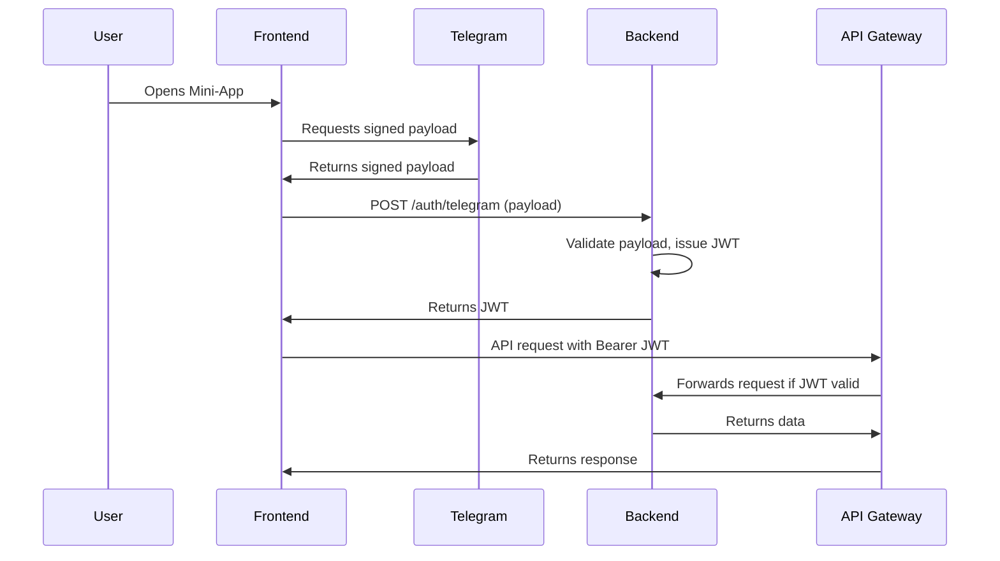

# User Authentication & API Security Specification

## Overview

This document outlines the requirements and implementation plan for securing user access to the Vibe REST API using AWS API Gateway, JWT tokens, and Telegram WebApp authentication. It covers both frontend and backend responsibilities with detailed code examples.

---

## 1. Authentication Flow

### 1.1. User Identity Source
- **Telegram WebApp**: Users authenticate via Telegram Mini-App SDK, which provides a signed payload containing user identity.

### 1.2. Token Issuance
- **Backend**: Validates Telegram payload, issues a short-lived JWT (JSON Web Token) for API access.
- **JWT Claims**: Must include user ID, Telegram ID, issued-at, expiry, and optionally active profile ID.

### 1.3. API Access
- **Frontend**: Attaches JWT as a Bearer token in the `Authorization` header for all API requests.
- **Backend**: Validates JWT on every request, checks claims, and enforces profile-level authorization.

---

## 2. Frontend Implementation

### 2.1. Telegram WebApp Integration

```typescript
// Initialize Telegram WebApp
const tg = window.Telegram.WebApp;

// Get Telegram authentication data
const initData = tg.initData;
const initDataUnsafe = tg.initDataUnsafe;

// Extract user information
const telegramUser = {
  id: initDataUnsafe.user?.id,
  username: initDataUnsafe.user?.username,
  first_name: initDataUnsafe.user?.first_name,
  // ... other Telegram user fields
};
```

### 2.2. Authentication State Management

```typescript
// Auth context for React
interface AuthState {
  isAuthenticated: boolean;
  token: string | null;
  userId: string | null;
  activeProfileId: string | null;
}

// Auth provider component
const AuthProvider = ({ children }) => {
  const [authState, setAuthState] = useState<AuthState>({
    isAuthenticated: false,
    token: null,
    userId: null,
    activeProfileId: null,
  });

  const authenticate = async () => {
    try {
      // Send Telegram init data to backend for verification
      const response = await fetch('/api/v1/auth/telegram', {
        method: 'POST',
        headers: { 'Content-Type': 'application/json' },
        body: JSON.stringify({
          initData: window.Telegram.WebApp.initData,
          telegramUser: window.Telegram.WebApp.initDataUnsafe.user,
        }),
      });

      const { token, userId } = await response.json();
      
      // Store token securely
      localStorage.setItem('authToken', token);
      
      setAuthState({
        isAuthenticated: true,
        token,
        userId,
        activeProfileId: null,
      });
    } catch (error) {
      console.error('Authentication failed:', error);
    }
  };

  return (
    <AuthContext.Provider value={{ authState, authenticate }}>
      {children}
    </AuthContext.Provider>
  );
};
```

### 2.3. API Client with Authentication

```typescript
// API client with automatic token injection
class ApiClient {
  private baseURL = process.env.REACT_APP_API_BASE_URL;
  
  private async request(endpoint: string, options: RequestInit = {}) {
    const token = localStorage.getItem('authToken');
    
    const config: RequestInit = {
      ...options,
      headers: {
        'Content-Type': 'application/json',
        ...(token && { 'Authorization': `Bearer ${token}` }),
        ...options.headers,
      },
    };

    const response = await fetch(`${this.baseURL}${endpoint}`, config);
    
    // Handle token expiration
    if (response.status === 401) {
      localStorage.removeItem('authToken');
      // Redirect to re-authentication
      window.location.reload();
    }
    
    return response;
  }

  // API methods
  async getProfiles() {
    return this.request('/api/v1/profiles');
  }
  
  async createProfile(data: CreateProfileData) {
    return this.request('/api/v1/profiles', {
      method: 'POST',
      body: JSON.stringify(data),
    });
  }
}
```

---

## 3. Backend Implementation

### 3.1. Telegram Data Verification (Lambda Function)

```python
import hmac
import hashlib
import json
from urllib.parse import unquote

def verify_telegram_data(init_data: str, bot_token: str) -> bool:
    """Verify Telegram WebApp init data integrity"""
    try:
        # Parse the init data
        data_pairs = []
        hash_value = None
        
        for item in init_data.split('&'):
            if item.startswith('hash='):
                hash_value = item[5:]
            else:
                data_pairs.append(item)
        
        # Sort and join data
        data_pairs.sort()
        data_check_string = '\n'.join(data_pairs)
        
        # Create secret key
        secret_key = hmac.new(
            b"WebAppData", 
            bot_token.encode(), 
            hashlib.sha256
        ).digest()
        
        # Calculate expected hash
        expected_hash = hmac.new(
            secret_key,
            data_check_string.encode(),
            hashlib.sha256
        ).hexdigest()
        
        return hash_value == expected_hash
    except Exception:
        return False

# Authentication Lambda function
def lambda_handler(event, context):
    body = json.loads(event['body'])
    init_data = body.get('initData')
    telegram_user = body.get('telegramUser')
    
    # Verify Telegram data
    bot_token = os.environ['TELEGRAM_BOT_TOKEN']
    if not verify_telegram_data(init_data, bot_token):
        return {
            'statusCode': 401,
            'body': json.dumps({'error': 'Invalid Telegram data'})
        }
    
    # Generate or retrieve user ID (16-char base64)
    telegram_id = str(telegram_user['id'])
    user_id = generate_user_id(telegram_id)
    
    # Create or update user in DynamoDB
    create_or_update_user(user_id, telegram_user)
    
    # Generate JWT token
    token = generate_jwt_token(user_id)
    
    return {
        'statusCode': 200,
        'body': json.dumps({
            'token': token,
            'userId': user_id
        })
    }
```

### 3.2. JWT Token Management

```python
import jwt
import datetime
import os

def generate_jwt_token(user_id: str) -> str:
    """Generate JWT token for authenticated user"""
    payload = {
        'user_id': user_id,
        'iat': datetime.datetime.utcnow(),
        'exp': datetime.datetime.utcnow() + datetime.timedelta(days=7),
        'iss': 'vibe-app'
    }
    
    secret = os.environ['JWT_SECRET']
    return jwt.encode(payload, secret, algorithm='HS256')

def verify_jwt_token(token: str) -> dict:
    """Verify and decode JWT token"""
    try:
        secret = os.environ['JWT_SECRET']
        payload = jwt.decode(token, secret, algorithms=['HS256'])
        return payload
    except jwt.ExpiredSignatureError:
        raise Exception('Token has expired')
    except jwt.InvalidTokenError:
        raise Exception('Invalid token')
```

### 3.3. AWS API Gateway Authorizer

```python
# Custom Lambda authorizer for API Gateway
def lambda_authorizer(event, context):
    token = event['authorizationToken'].replace('Bearer ', '')
    
    try:
        # Verify JWT token
        payload = verify_jwt_token(token)
        user_id = payload['user_id']
        
        # Generate policy allowing access
        policy = {
            'principalId': user_id,
            'policyDocument': {
                'Version': '2012-10-17',
                'Statement': [
                    {
                        'Action': 'execute-api:Invoke',
                        'Effect': 'Allow',
                        'Resource': event['methodArn']
                    }
                ]
            },
            'context': {
                'userId': user_id
            }
        }
        
        return policy
        
    except Exception as e:
        # Deny access
        raise Exception('Unauthorized')
```

---

## 4. AWS API Gateway Security

### 4.1. Gateway Authorizer
- **JWT Authorizer**: API Gateway uses a Lambda or native JWT authorizer to validate tokens.
- **Token Source**: `Authorization` header.
- **Rejection**: Requests with missing/invalid/expired tokens are rejected with 401 Unauthorized.

### 4.2. Authorizer Setup

```yaml
# CloudFormation/CDK configuration
ApiGatewayAuthorizer:
  Type: AWS::ApiGateway::Authorizer
  Properties:
    Name: VibePlatformAuthorizer
    Type: TOKEN
    AuthorizerUri: !Sub 
      - arn:aws:apigateway:${ApiRegion}:lambda:path/2015-03-31/functions/${LambdaArn}/invocations
      - LambdaArn: !GetAtt AuthorizerFunction.Arn
    AuthorizerCredentials: !GetAtt ApiGatewayAuthorizerRole.Arn
    AuthorizerResultTtlInSeconds: 300
    IdentitySource: method.request.header.Authorization
```

### 4.3. Resource Protection

```yaml
# Protect API resources
ProfilesResource:
  Type: AWS::ApiGateway::Resource
  Properties:
    RestApiId: !Ref ApiGateway
    ParentId: !GetAtt ApiGateway.RootResourceId
    PathPart: profiles

ProfilesMethod:
  Type: AWS::ApiGateway::Method
  Properties:
    RestApiId: !Ref ApiGateway
    ResourceId: !Ref ProfilesResource
    HttpMethod: GET
    AuthorizationType: CUSTOM
    AuthorizerId: !Ref ApiGatewayAuthorizer
```

### 4.4. Rate Limiting & Throttling
- **API Gateway**: Enforces per-user and global rate limits to prevent abuse.

### 4.5. CORS
- **Configuration**: Only allow requests from trusted frontend origins (Telegram Mini-App domain).

---

## 5. Security Considerations

### 5.1. Environment Variables

```bash
# Required environment variables
TELEGRAM_BOT_TOKEN=your_bot_token
JWT_SECRET=your_jwt_secret_key
TELEGRAM_WEBHOOK_SECRET=your_webhook_secret
```

### 5.2. Token Storage Security
- Use secure storage on frontend (localStorage with encryption)
- Implement token refresh mechanism
- Set appropriate token expiration times
- Clear tokens on logout

### 5.3. API Security Headers

```python
# Add security headers to all responses
def add_security_headers(response):
    response['headers'] = {
        **response.get('headers', {}),
        'X-Content-Type-Options': 'nosniff',
        'X-Frame-Options': 'DENY',
        'X-XSS-Protection': '1; mode=block',
        'Strict-Transport-Security': 'max-age=31536000; includeSubDomains',
        'Content-Security-Policy': "default-src 'self'"
    }
    return response
```

### 5.4. Additional Security Measures
- **Input Validation**: Sanitize all user input.
- **Data Isolation**: Ensure users can only access their own data.
- **HTTPS Only**: Enforce HTTPS for all API endpoints.
- **Monitoring**: Use CloudWatch for API access logs and anomaly detection.
- **GDPR Compliance**: Allow users to delete their data and respect retention policies.

---

## 6. Sequence Diagram



---

## 7. Implementation Checklist

### Frontend Tasks
- [ ] Integrate Telegram Mini-App SDK for authentication
- [ ] Implement authentication state management with React Context
- [ ] Create API client with automatic token injection
- [ ] Handle token expiration and re-authentication
- [ ] Implement secure token storage
- [ ] Add error handling for authentication failures

### Backend Tasks
- [ ] Implement `/auth/telegram` endpoint with Telegram data verification
- [ ] Create JWT token generation and validation functions
- [ ] Set up AWS Lambda authorizer for API Gateway
- [ ] Implement user creation/update in DynamoDB
- [ ] Add security headers to all responses
- [ ] Set up CloudWatch logging and monitoring

### AWS Infrastructure Tasks
- [ ] Configure API Gateway with JWT authorizer
- [ ] Set up Lambda functions for authentication and authorization
- [ ] Configure CORS settings for Telegram Mini-App domain
- [ ] Set up rate limiting and throttling
- [ ] Configure environment variables and secrets
- [ ] Set up CloudWatch alarms for security events

---

## 8. References

- [Telegram Mini-Apps Auth](https://core.telegram.org/bots/webapps#validating-data-received-via-the-mini-app)
- [AWS API Gateway JWT Authorizer](https://docs.aws.amazon.com/apigateway/latest/developerguide/http-api-user-jwt-authorizer.html)
- [OWASP REST Security](https://owasp.org/www-project-api-security/)
- [JWT.io](https://jwt.io/) - JWT token debugging and validation
- [AWS Lambda Authorizers](https://docs.aws.amazon.com/apigateway/latest/developerguide/apigateway-use-lambda-authorizer.html) 