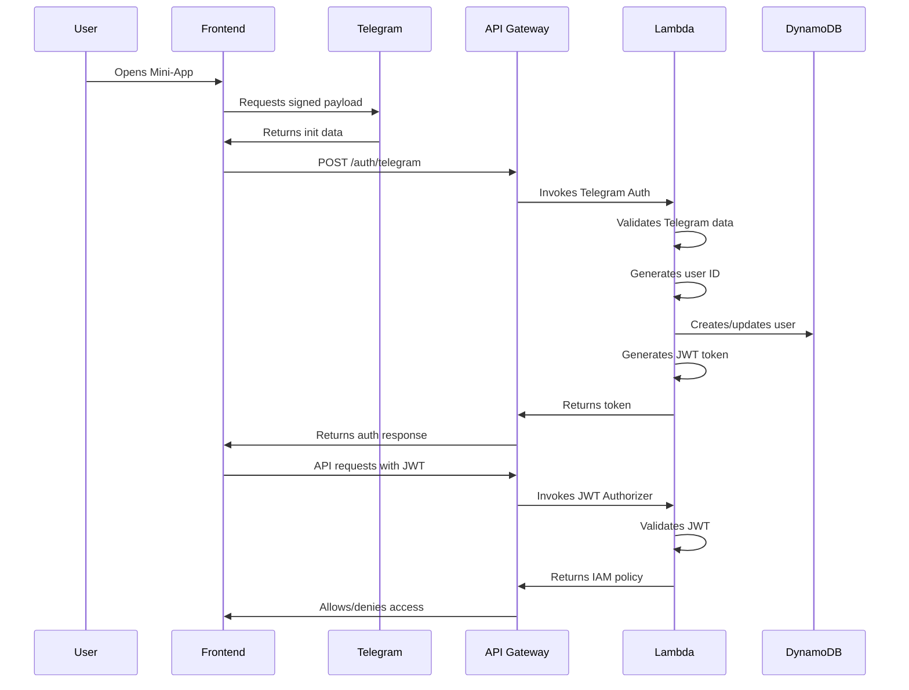

# Vibe Authentication Service - Implementation Summary

## 🎯 Overview

This document summarizes the complete implementation of the Vibe Dating App authentication service, which provides secure Telegram WebApp authentication with JWT tokens for API access.

## 📁 Project Structure

```
src/services/auth/
├── cloudformation/
│   ├── template.yaml          # Complete CloudFormation infrastructure
│   └── parameters.yaml        # Deployment parameters
├── lambda/
│   ├── telegram_auth.py       # Telegram authentication Lambda
│   ├── jwt_authorizer.py      # JWT authorization Lambda
│   ├── requirements.txt       # Python dependencies
│   └── test_auth.py          # Local testing script
├── examples/
│   └── frontend_integration.js # Frontend integration example
├── deploy.sh                  # Automated deployment script
├── validate_template.sh       # Template validation script
├── README.md                  # Comprehensive documentation
└── IMPLEMENTATION_SUMMARY.md  # This file
```

## 🏗️ Infrastructure Components

### 1. DynamoDB Table (`vibe-dating-{env}`)
- **Single-table design** with comprehensive schema
- **6 Global Secondary Indexes** for efficient queries
- **KMS encryption** for data at rest
- **Point-in-time recovery** enabled
- **Pay-per-request** billing for cost optimization

### 2. Lambda Functions
- **Telegram Auth Function** (`vibe-telegram-auth-{env}`)
  - Validates Telegram WebApp init data
  - Generates deterministic user IDs
  - Creates/updates user records
  - Issues JWT tokens
- **JWT Authorizer Function** (`vibe-jwt-authorizer-{env}`)
  - Validates JWT tokens for API Gateway
  - Returns IAM policies for access control
  - Provides user context to downstream functions

### 3. API Gateway
- **REST API** with custom domain support
- **JWT Authorizer** for secure endpoint protection
- **CORS configuration** for Telegram domains
- **Regional endpoint** for optimal performance

### 4. Security & Monitoring
- **KMS encryption** for sensitive data
- **CloudWatch logging** for all Lambda functions
- **Security headers** implementation
- **IAM roles** with least privilege access

## 🔐 Authentication Flow



## 🆔 User ID Generation

The service implements deterministic user ID generation using UUID v5:

```python
def hash_string_to_id(platform_id_string: str, length: int = 8) -> str:
    # Platform string: "tg:123456789"
    namespace_uuid = uuid.UUID('f205b16e-4eac-11f0-a692-00155dcd3c6a')
    user_uuid = uuid.uuid5(namespace_uuid, platform_id_string)
    uuid_bytes = user_uuid.bytes
    base64_string = base64.b64encode(uuid_bytes).decode('utf-8')
    return base64_string.rstrip('=')[:length]
```

**Properties:**
- ✅ **Deterministic**: Same input always produces same output
- ✅ **Collision Resistant**: Uses UUID v5 with fixed namespace
- ✅ **Compact**: 8-character Base64 strings
- ✅ **Platform Agnostic**: Extensible for other platforms

## 🔒 Security Features

### JWT Token Security
- **Algorithm**: HS256
- **Expiration**: 7 days
- **Claims**: user_id, iat, exp, iss
- **Secret**: Environment variable (KMS encrypted)

### Data Protection
- **DynamoDB Encryption**: KMS customer-managed keys
- **API Gateway**: HTTPS only
- **Security Headers**: XSS protection, content type options
- **CORS**: Restricted to Telegram domains

### Input Validation
- Telegram data integrity verification
- JWT token validation
- Request body validation

## 🚀 Deployment

### Prerequisites
1. AWS CLI installed and configured
2. AWS credentials with appropriate permissions
3. Telegram Bot Token from @BotFather
4. JWT Secret (secure random string)

### Quick Start
```bash
cd src/services/auth

# 1. Update parameters
# Edit cloudformation/parameters.yaml with your values

# 2. Validate template
./validate_template.sh

# 3. Deploy stack
./deploy.sh deploy

# 4. Check status
./deploy.sh status
```

### Manual Deployment
```bash
aws cloudformation create-stack \
  --stack-name vibe-auth-service \
  --template-body file://cloudformation/template.yaml \
  --parameters file://cloudformation/parameters.yaml \
  --capabilities CAPABILITY_NAMED_IAM \
  --tags Key=Environment,Value=dev Key=Service,Value=auth
```

## 📊 DynamoDB Schema

### User Entity
```json
{
  "PK": "USER#{userId}",
  "SK": "METADATA",
  "telegramId": "123456789",
  "telegramUsername": "username",
  "telegramFirstName": "John",
  "telegramLastName": "Doe",
  "createdAt": "2024-01-01T00:00:00Z",
  "lastActiveAt": "2024-01-01T12:00:00Z",
  "isBanned": false,
  "banReason": null,
  "banExpiresAt": null,
  "preferences": {
    "notifications": true,
    "privacy": "public"
  },
  "GSI1PK": "USER#{userId}",
  "GSI1SK": "METADATA"
}
```

### Global Secondary Indexes
- **GSI1**: User-Profile Lookup
- **GSI2**: Location Queries
- **GSI3**: Room Activity
- **GSI4**: User Activity
- **GSI5**: Media Management
- **GSI6**: Block/Ban Lookup

## 🧪 Testing

### Local Testing
```bash
cd src/services/auth/lambda
python test_auth.py
```

### API Testing
```bash
# Get API Gateway URL
aws cloudformation describe-stacks \
  --stack-name vibe-auth-service \
  --query 'Stacks[0].Outputs[?OutputKey==`ApiGatewayUrl`].OutputValue' \
  --output text

# Test authentication
curl -X POST https://your-api-url/dev/auth/telegram \
  -H "Content-Type: application/json" \
  -d '{
    "initData": "your_telegram_init_data",
    "telegramUser": {
      "id": 123456789,
      "username": "testuser",
      "first_name": "Test",
      "last_name": "User"
    }
  }'
```

## 📱 Frontend Integration

The service includes a complete frontend integration example:

```javascript
// Initialize authentication
const authService = new VibeAuthService();
await authService.initialize();

// Create API client
const apiClient = new VibeApiClient(authService);

// Use authenticated API
const profiles = await apiClient.getProfiles();
```

## 🔍 Monitoring

### CloudWatch Logs
- `/aws/lambda/vibe-telegram-auth-{env}`
- `/aws/lambda/vibe-jwt-authorizer-{env}`

### Key Metrics
- API Gateway request count and latency
- Lambda function duration and errors
- DynamoDB read/write capacity

### Alarms
- High error rate
- High latency
- Authentication failures

## 🛠️ Development

### Local Development Setup
```bash
# Create virtual environment
python -m venv venv
source venv/bin/activate

# Install dependencies
pip install -r lambda/requirements.txt

# Set environment variables
export TELEGRAM_BOT_TOKEN="your_bot_token"
export JWT_SECRET="your_jwt_secret"
export DYNAMODB_TABLE="vibe-dating-dev"
```

### Code Quality
- Type hints for all functions
- Comprehensive error handling
- Security best practices
- Extensive documentation

## 📈 Scalability

### Performance Optimizations
- **Lambda Cold Start**: Minimal dependencies
- **DynamoDB**: Single-table design with GSIs
- **API Gateway**: Regional endpoints
- **Caching**: JWT authorizer result caching (5 minutes)

### Cost Optimization
- **DynamoDB**: Pay-per-request billing
- **Lambda**: Minimal memory allocation
- **API Gateway**: Regional deployment
- **KMS**: Customer-managed keys

## 🔄 Future Enhancements

### Planned Features
- [ ] Token refresh mechanism
- [ ] Multi-factor authentication
- [ ] Rate limiting per user
- [ ] Advanced user analytics
- [ ] A/B testing support
- [ ] Real-time user presence

### Extensibility
- **Platform Support**: Easy to add other platforms
- **Custom Claims**: Extensible JWT claims
- **Plugin Architecture**: Modular Lambda functions
- **Multi-region**: Global deployment support

## 📚 Documentation

### Key Documents
- `README.md` - Comprehensive service documentation
- `docs/auth_service.md` - Authentication specification
- `docs/context.md` - Application context
- `docs/user_service-user_id_hashing.md` - ID generation details

### API Documentation
- REST API endpoints
- Request/response schemas
- Error handling
- Authentication examples

## ✅ Implementation Checklist

### Infrastructure
- [x] CloudFormation template with all resources
- [x] DynamoDB table with proper schema
- [x] Lambda functions with proper IAM roles
- [x] API Gateway with JWT authorizer
- [x] KMS encryption for data security
- [x] CloudWatch logging and monitoring

### Authentication
- [x] Telegram WebApp data validation
- [x] Deterministic user ID generation
- [x] JWT token generation and validation
- [x] User creation/update in DynamoDB
- [x] Security headers implementation
- [x] CORS configuration

### Development
- [x] Local testing framework
- [x] Deployment automation
- [x] Frontend integration examples
- [x] Comprehensive documentation
- [x] Error handling and validation
- [x] Security best practices

### Operations
- [x] Automated deployment scripts
- [x] Template validation
- [x] Stack status monitoring
- [x] Troubleshooting guides
- [x] Performance optimization
- [x] Cost optimization

## 🎉 Conclusion

The Vibe Authentication Service provides a complete, production-ready authentication solution for the Telegram Mini-App platform. It implements all security best practices, follows AWS well-architected principles, and provides comprehensive documentation for easy deployment and maintenance.

The service is designed to be:
- **Secure**: Multiple layers of security and encryption
- **Scalable**: Serverless architecture with auto-scaling
- **Maintainable**: Well-documented and modular code
- **Cost-effective**: Optimized for minimal AWS costs
- **Extensible**: Easy to add new features and platforms

This implementation serves as a solid foundation for the Vibe dating application and can be easily extended to support additional features and platforms. 