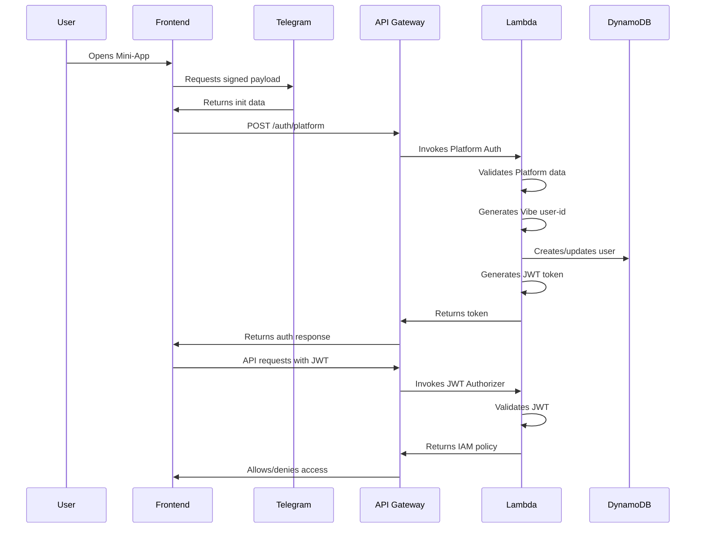

# Vibe Dating App - Authentication Service

A complete, production-ready authentication service for the Vibe dating application using Telegram WebApp authentication and JWT tokens.

## Overview

The authentication service provides secure authentication for the Vibe dating application with the following components:

1. **Platform Authentication Lambda** - Validates Telegram WebApp data and issues JWT tokens
2. **JWT Authorizer Lambda** - Validates JWT tokens for API Gateway requests
3. **DynamoDB Table** - Stores user data with single-table design
4. **API Gateway** - Provides REST API endpoints with JWT authorization
5. **KMS Encryption** - Secures sensitive data at rest

## Architecture

```
┌─────────────────┐    ┌──────────────────┐    ┌─────────────────┐
│   Frontend      │    │   API Gateway    │    │   Lambda        │
│   (Telegram     │───▶│   (JWT Auth)     │───▶│   Functions     │
│   Mini-App)     │    │                  │    │                 │
└─────────────────┘    └──────────────────┘    └─────────────────┘
                                │                        │
                                ▼                        ▼
                       ┌──────────────────┐    ┌─────────────────┐
                       │   DynamoDB       │    │   CloudWatch    │
                       │   (User Data)    │    │   (Logs)        │
                       └──────────────────┘    └─────────────────┘
```

## Features

- ✅ **Telegram WebApp Authentication** - Secure validation of Telegram init data
- ✅ **Deterministic User ID Generation** - UUID v5-based consistent user identification
- ✅ **JWT Token Management** - Secure token generation and validation
- ✅ **DynamoDB Single-Table Design** - Efficient data storage with 6 GSIs
- ✅ **KMS Encryption** - Customer-managed keys for data at rest
- ✅ **API Gateway Integration** - Custom JWT authorizer for endpoint protection
- ✅ **CORS Support** - Configured for Telegram domains
- ✅ **Security Headers** - XSS protection and content security
- ✅ **CloudWatch Monitoring** - Comprehensive logging and metrics
- ✅ **Automated Deployment** - CloudFormation-based infrastructure as code
- ✅ **Lambda Layers** - Optimized dependency management and cold starts
- ✅ **AWS Secrets Manager Integration** - Centralized secret management
- ✅ **Multi-Environment Support** - Dev, staging, and production deployments
- ✅ **Comprehensive Testing** - Unit tests, integration tests, and validation
- ✅ **Frontend Integration Examples** - Complete client-side integration guide

## Project Structure

### Code Organization

The authentication service follows a modular code organization to eliminate duplication and improve maintainability:

```
src/services/auth/
├── cloudformation/
│   └── template.yaml          # Complete CloudFormation infrastructure
├── aws_lambdas/
│   ├── core/
│   │   └── auth_utils.py      # Shared auth utilities
│   ├── auth_platform/
│   │   └── lambda_function.py # Platform authentication Lambda
│   ├── auth_jwt_authorizer/
│   │   └── lambda_function.py # JWT authorization Lambda
│   ├── test/                  # Test files
│   │   ├── test_layer.py      # Lambda layer test
│   │   ├── test_structure.py  # Code structure test
│   │   └── test_auth.py       # Authentication test
│   ├── requirements.txt       # Python dependencies for Lambda layer
│   └── README.md              # Lambda documentation
└── README.md                  # This file
```

### Modular Design Benefits

- **Auth Utilities**: Common functions used by multiple Lambda functions
- **Function Separation**: Each Lambda function has its own directory with clear separation
- **Shared Dependencies**: Both functions use the Vibe Base Layer for Python packages
- **Consistent Structure**: All functions follow the same pattern for easy navigation
- **Scalable Architecture**: Easy to add new functions following the same pattern

## Authentication Flow



## User ID Generation

The service implements deterministic user ID generation using UUID v5:

```python
def hash_string_to_id(platform_id_string: str) -> str:
    # Platform string: "tg:123456789"
    namespace_uuid = uuid.UUID('<uuid-namespace-secret>')
    user_uuid = uuid.uuid5(namespace_uuid, platform_id_string)
    uuid_bytes = user_uuid.bytes
    base64_string = base64.b64encode(uuid_bytes).decode('utf-8')
    return base64_string.rstrip('=')[:core_settings.record_id_length]
```

**Properties:**
- ✅ **Deterministic**: Same input always produces same output
- ✅ **Collision Resistant**: Uses UUID v5 with fixed namespace
- ✅ **Compact**: 8-character Base64 strings
- ✅ **Platform Agnostic**: Extensible for other platforms

**Example:**
- Telegram ID: `123456789`
- Platform String: `telegram:123456789`
- Final User ID: `aB3cD4eF`

## Security Features

### JWT Token Security
- **Algorithm**: HS256
- **Expiration**: 7 days
- **Claims**: user_id, iat, exp, iss
- **Secret**: Environment variable (KMS encrypted)

### Data Protection
- **DynamoDB Encryption**: KMS customer-managed keys
- **API Gateway**: HTTPS only
- **Security Headers**: XSS protection, content type options, frame options
- **CORS**: Restricted to Telegram domains

### Input Validation
- Telegram data integrity verification
- JWT token validation
- Request body validation

## Deployment

### Lambda Layers Architecture

The authentication service uses AWS Lambda Layers to optimize deployment and performance:

#### Vibe Base Layer (`vibe-auth-layer-{env}`)
- **Purpose**: Shared Python dependencies for all Lambda functions
- **Contents**: PyJWT, boto3, requests, urllib3, python-dateutil
- **Benefits**:
  - Reduces deployment package sizes
  - Faster cold start times
  - Centralized dependency management
  - Easier updates and maintenance

#### Layer Structure
```
core_layer.zip
└── python/
    ├── PyJWT/
    ├── boto3/
    ├── botocore/
    ├── requests/
    ├── urllib3/
    └── python_dateutil/
```

### Prerequisites

1. **AWS CLI** installed and configured
2. **AWS Credentials** with appropriate permissions
3. **Telegram Bot Token** from @BotFather
4. **JWT Secret** (secure random string)
5. **Python 3.11+** for Lambda runtime compatibility
6. **Poetry** for dependency management

### Quick Deployment

1. **Setup Secrets** (if not already done):
   ```bash
   # Install secrets management dependencies
   pip install -r scripts/requirements-secrets.txt
   
   # Setup core secrets interactively
   python scripts/secretsmanager_mgmt.py setup
   ```

2. **Update Parameters**:
   ```bash
   # Edit src/config/parameters.json
   # Set your actual parameters
   ```

3. **Build and Deploy**:
   ```bash
   # From project root
   poetry run service-deploy auth
   ```
   This will automatically:
   - Build Lambda function packages
   - Upload packages to S3
   - Deploy/update CloudFormation stack

4. **Verify Deployment**:
   ```bash
   # Check stack status
   aws cloudformation describe-stacks --stack-name vibe-dating-auth-service
   ```

### Manual Build and Deploy

```bash
# Build Lambda packages only
poetry run service-build auth

# Deploy stack only (if packages already built)
poetry run service-deploy auth
```

### Manual Deployment

```bash
# Validate template
aws cloudformation validate-template \
  --template-body file://cloudformation/template.yaml

# Create stack
aws cloudformation create-stack \
  --stack-name vibe-auth-service \
  --template-body file://src/services/auth/cloudformation/template.yaml \
  --parameters file://src/config/cloudformation/parameters.yaml \
  --capabilities CAPABILITY_NAMED_IAM \
  --tags Key=Environment,Value=dev Key=Service,Value=auth

# Wait for completion
aws cloudformation wait stack-create-complete \
  --stack-name vibe-auth-service
```

### Deployment Commands

- `poetry run service-build auth` - Build and upload Lambda packages to S3
- `poetry run service-deploy auth` - Deploy infrastructure or update Lambda functions
  - If infrastructure doesn't exist: Deploys full CloudFormation stacks
  - If infrastructure exists: Downloads packages from S3 and updates Lambda function code
- `poetry run service-test auth` - Run tests and validation
- `aws cloudformation delete-stack --stack-name vibe-dating-auth-service` - Delete stack

**Note**: For updates, run `poetry run service-build auth` first to ensure the latest code is uploaded to S3.

## DynamoDB Schema

### User Entity
```json
{
  "PK": "USER#{userId}",
  "SK": "METADATA",
  "platform": "tg",
  "platformId": "123456789",
  "platformMetadata": {
    "username": "username",
    "first_name": "John",
    "last_name": "Doe",
    "language_code": "en",
    "is_premium": false,
    "added_to_attachment_menu": false
  },
  "createdAt": "2024-01-01T00:00:00Z",
  "lastActiveAt": "2024-01-01T12:00:00Z",
  "isBanned": false,
  "banReason": null,
  "banExpiresAt": null,
  "preferences": {
    "notifications": true,
    "privacy": "public"
  },
  "GSI1PK": "USER#{userId}",
  "GSI1SK": "METADATA"
}
```

### Global Secondary Indexes
- **GSI1**: User-Profile Lookup
- **GSI2**: Location Queries
- **GSI3**: Room Activity
- **GSI4**: User Activity
- **GSI5**: Media Management
- **GSI6**: Block/Ban Lookup

## Testing

### Comprehensive Test Suite
```bash
# Run all tests from project root
poetry run service-test auth
```

### Local Testing
```bash
cd src/services/auth/aws_lambdas

# Test Lambda layer dependencies
poetry run python test/test_layer.py

# Test code structure and imports
poetry run python test/test_structure.py

# Test authentication functions
poetry run python test/test_auth.py
```

### Individual Test Categories
```bash
# Lambda layer tests
poetry run python src/services/auth/aws_lambdas/test/test_layer.py

# Code structure tests
poetry run python src/services/auth/aws_lambdas/test/test_structure.py

# Authentication tests
poetry run python src/services/auth/aws_lambdas/test/test_auth.py

# Unit tests
poetry run pytest tests/
```

### API Testing
```bash
# Get API Gateway URL
aws cloudformation describe-stacks \
  --stack-name vibe-dating-auth-service \
  --query 'Stacks[0].Outputs[?OutputKey==`ApiGatewayUrl`].OutputValue' \
  --output text

# Test authentication
curl -X POST https://your-api-url/dev/auth/platform \
  -H "Content-Type: application/json" \
  -d '{
    "platform": "telegram",
    "platformToken": <telegram-init-data-string>,
    "platformMetaData": {}
  }'
```

## Frontend Integration

The service includes a complete frontend integration example with comprehensive API client:

### Complete Integration Example

See `docs/examples/frontend/auth.js` for a complete frontend integration example including:
- Authentication flow
- API client implementation
- Error handling
- Profile management
- Location-based features

## Monitoring

### CloudWatch Logs
- **Telegram Auth**: `/aws/lambda/vibe-auth-platform-{env}`
- **JWT Authorizer**: `/aws/lambda/vibe-auth-jwt-authorizer-{env}`

### Key Metrics
- API Gateway request count and latency
- Lambda function duration and errors
- DynamoDB read/write capacity

### Alarms
- High error rate
- High latency
- Authentication failures

## Development

### Local Development Setup
```bash
# Create virtual environment
python -m venv venv
source venv/bin/activate

# Install dependencies
pip install -r aws_lambdas/requirements.txt

# Set environment variables
export TELEGRAM_BOT_TOKEN="your_bot_token"
export JWT_SECRET="your_jwt_secret"
export DYNAMODB_TABLE="vibe-dating-dev"
```

### Code Quality
- Type hints for all functions
- Comprehensive error handling
- Security best practices
- Extensive documentation

## Scalability

### Performance Optimizations
- **Lambda Cold Start**: Lambda layers reduce cold start times
- **Lambda Layers**: Shared dependencies in Vibe Base Layer
- **DynamoDB**: Single-table design with GSIs
- **API Gateway**: Regional endpoints
- **Caching**: JWT authorizer result caching (5 minutes)

### Cost Optimization
- **DynamoDB**: Pay-per-request billing
- **Lambda**: Minimal memory allocation and shared layers
- **Lambda Layers**: Reduced storage costs for dependencies
- **API Gateway**: Regional deployment
- **KMS**: Customer-managed keys

## Future Enhancements

### Planned Features
- [ ] Token refresh mechanism
- [ ] Multi-factor authentication
- [ ] Rate limiting per user
- [ ] Advanced user analytics
- [ ] A/B testing support
- [ ] Real-time user presence
- [ ] Enhanced media processing
- [ ] Advanced moderation tools
- [ ] Analytics dashboard
- [ ] Performance monitoring

### Extensibility
- **Platform Support**: Easy to add other platforms (Discord, WhatsApp, etc.)
- **Custom Claims**: Extensible JWT claims for additional user data
- **Plugin Architecture**: Modular Lambda functions for easy feature addition
- **Multi-region**: Global deployment support for international users
- **Microservices**: Service decomposition for better scalability
- **Event-Driven Architecture**: Integration with SQS/SNS for async processing

## Troubleshooting

### Common Issues

1. **Template Validation Failed**
   - Check YAML syntax
   - Verify all required parameters

2. **Deployment Failed**
   - Check AWS credentials
   - Verify IAM permissions
   - Check CloudFormation events

3. **Authentication Errors**
   - Verify Telegram bot token
   - Check init data format
   - Validate JWT secret

4. **CORS Errors**
   - Verify allowed origins
   - Check API Gateway CORS settings

### Debug Commands

```bash
# Check stack events
aws cloudformation describe-stack-events \
  --stack-name vibe-dating-auth-service

# Check Lambda logs
aws logs tail /aws/lambda/vibe-auth-platform-dev --follow

# Test DynamoDB access
aws dynamodb scan --table-name vibe-dating-dev --limit 1
```

## Implementation Checklist

### Infrastructure
- [x] CloudFormation template with all resources
- [x] DynamoDB table with proper schema
- [x] Lambda functions with proper IAM roles
- [x] Lambda layer for shared dependencies
- [x] API Gateway with JWT authorizer
- [x] KMS encryption for data security
- [x] CloudWatch logging and monitoring
- [x] AWS Secrets Manager integration
- [x] Multi-environment support

### Authentication
- [x] Telegram WebApp data validation
- [x] Deterministic user ID generation
- [x] JWT token generation and validation
- [x] User creation/update in DynamoDB
- [x] Security headers implementation
- [x] CORS configuration
- [x] Comprehensive error handling

### Development
- [x] Local testing framework
- [x] Deployment automation
- [x] Frontend integration examples
- [x] Comprehensive documentation
- [x] Error handling and validation
- [x] Security best practices
- [x] Code quality tools (Black, isort, mypy)
- [x] Unit and integration tests

### Operations
- [x] Automated deployment scripts
- [x] Lambda layer and function build scripts
- [x] Template validation
- [x] Stack status monitoring
- [x] Troubleshooting guides
- [x] Performance optimization
- [x] Cost optimization
- [x] Secrets management automation
- [x] Environment promotion workflows

## Conclusion

The Vibe Authentication Service provides a complete, production-ready authentication solution for the Telegram Mini-App platform. It implements all security best practices, follows AWS well-architected principles, and provides comprehensive documentation for easy deployment and maintenance.

The service is designed to be:
- **Secure**: Multiple layers of security and encryption
- **Scalable**: Serverless architecture with auto-scaling
- **Maintainable**: Well-documented and modular code
- **Cost-effective**: Optimized for minimal AWS costs
- **Extensible**: Easy to add new features and platforms
- **Developer-Friendly**: Comprehensive testing, documentation, and examples

This implementation serves as a solid foundation for the Vibe dating application and can be easily extended to support additional features and platforms. The service is ready for production deployment and provides a robust foundation for building advanced dating application features.

### Next Steps

After deploying the authentication service:
1. **Deploy Core Infrastructure** - Use `poetry run service-deploy core` to set up foundational AWS resources
2. **Configure Frontend Integration** - Use the provided examples to integrate with your frontend
3. **Set Up Monitoring** - Configure CloudWatch alarms and dashboards
4. **Plan Additional Services** - Consider implementing user, media, and Agora services
5. **Scale and Optimize** - Monitor performance and optimize based on usage patterns 